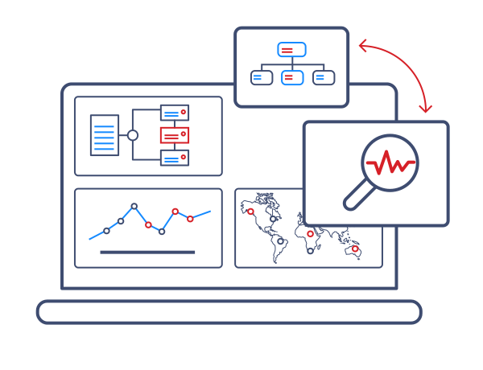
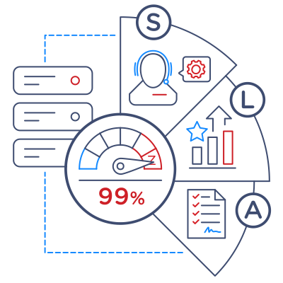
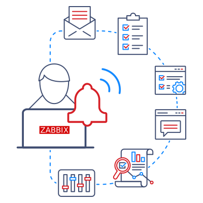
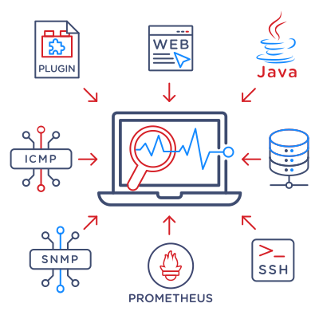
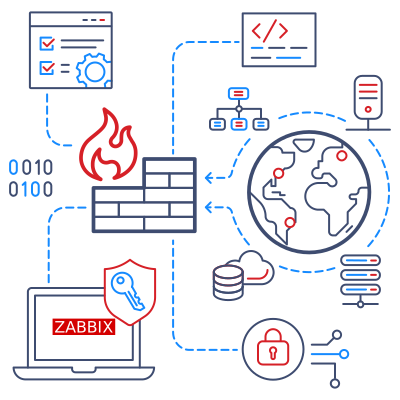

# Workshop detallado de Zabbix

## <span style="color: blue;"><strong>Introducción, fundamentos y primeros pasos del Monitoreo con Zabbix</strong></span>

## **Módulo –** <span style="color: green;">Bienvenida e introducción</span>

**Objetivo:** Presentación, objetivos, agenda, expectativas.

---

### **1. Presentación**

- Breve presentación de los instructores.
- <u>Conocer el perfil de los participantes.</u>

---

### **2. Objetivos del workshop**

- Aprender los **fundamentos de monitoreo**.
- Conocer la **arquitectura de Zabbix**.
- Configurar hosts, templates y reglas de descubrimiento.
- Recolectar datos y analizar métricas.
- Preparar a los participantes para administrar su propio entorno Zabbix.

---

### **3. Agenda general**

El workshop cubre: Introducción, fundamentos y primeros pasos del Monitoreo con Zabbix, y Alertas, automatización y mejores prácticas.

---

### **4. Metodología**

- 70% práctica y 30% teoría.
- Uso de **demos guiadas** y **ejercicios integradores**.
- Material complementario disponible para descargar.

---

### **5. Expectativas**

- Participación activa durante los ejercicios.
- Consultar dudas en cualquier momento.
- Reforzar el aprendizaje con ejemplos reales.

### 6. Dinámica de trabajo

- Herramientas que se utilizarán.
- Entrega de material y ejercicios.

## **Módulo 1 –** <span style="color: green;">Introducción al monitoreo y a Zabbix</span>

**Objetivo:** Entender qué es el monitoreo, para qué sirve y por qué **Zabbix** es una herramienta poderosa para gestionar la infraestructura de TI.

---

### **1.1. Introducción al monitoreo**

 El **monitoreo** es el proceso de observar de forma continua **sistemas, redes, aplicaciones, dispositivos y servicios** para detectar problemas, prevenir incidentes y garantizar la disponibilidad.


 **¿Por qué es importante monitorear?**

 - Garantiza **alta disponibilidad** de los servicios críticos.
 - Permite detectar problemas **antes** de que afecten a los usuarios.
 - Facilita la **planificación de capacidad** y el **crecimiento de la infraestructura**.
 - Mejora la **eficiencia operativa** al centralizar la información.
 - Proporciona datos clave para la **toma de decisiones** técnicas y de negocio.

---

### **1.2. Casos típicos de uso en empresas**

<div style="display: grid; grid-template-columns: 1fr 1fr; gap: 20px; align-items: start;">
<div>

<ul>
<li>Monitoreo de <strong>servidores</strong> (CPU, RAM, disco, procesos).</li>
<li>Control de <strong>bases de datos</strong> (MySQL, PostgreSQL, Oracle, etc.).</li>
<li>Supervisión de <strong>servicios críticos</strong> (ERP, CRM, intranets, APIs).</li>
<li>Control de <strong>dispositivos de red</strong> (switches, routers, firewalls).</li>
<li>Monitoreo de <strong>aplicaciones</strong> y disponibilidad de sitios web.</li>
<li>Gestión de <strong>entornos cloud</strong> e <strong>infraestructuras híbridas</strong>.</li>
<li>Integración con <strong>herramientas ITSM</strong> para gestión de incidentes.</li>
</ul>

</div>
<div>


</div>
</div>

---

### **1.3. Qué es Zabbix**

 **Zabbix** es una **solución de monitoreo distribuido, de código abierto y de clase empresarial**.


 Permite centralizar la recolección, almacenamiento, visualización y alerta de métricas de múltiples fuentes.

 **<u>Características principales</u>**

 - **Open Source** y gratuito.
 - Monitoreo **híbrido**: servidores, redes, aplicaciones, contenedores, IoT, cloud.
 - **Alta escalabilidad**: desde decenas hasta miles de hosts.
 - Compatible con múltiples **métodos de recolección**:
     - Agentes Zabbix.
     - SNMP.
     - ICMP.
     - HTTP / API REST.
     - Scripts personalizados.
 - Interfaz **web intuitiva** y personalizable.
 - **Alertas automáticas**, flexibles y personalizables.
 - Integraciones con **herramientas externas** (Grafana, Ansible, Slack, Telegram, etc.).

 

---

### **1.4. Beneficios de implementar Zabbix**

 | **Beneficio** | **Cómo ayuda Zabbix** | **Impacto en la empresa** |
 | --- | --- | --- |
 | **Reducción de inactividad** | Detecta fallos antes de que escalen. | Menos downtime y mejor disponibilidad. |
 | **Detección temprana** | Alertas automáticas y en tiempo real. | Respuesta proactiva ante incidentes. |
 | **Optimización de recursos** | Métricas históricas y tendencias. | Mejor planificación de capacidad. |
 | **Soporte a decisiones** | Reportes y dashboards dinámicos. | Datos confiables para líderes y áreas de negocio. |
 | **Escalabilidad** | Arquitectura distribuida y proxies. | Crece junto con la infraestructura. |

---

### **1.5. Comparativa con otras soluciones**

 | Característica | **Zabbix** | **Prometheus** | **Nagios** | **Datadog** |
 | --- | --- | --- | --- | --- |
 | **Licencia** | Open Source | Open Source | Open Source | SaaS (pago) |
 | **Visualización** | Dashboards nativos + Grafana | Grafana | Limitada | Muy avanzada |
 | **Escalabilidad** | Alta (miles de hosts) | Muy alta | Media | Alta |
 | **Alertas** | Nativas y flexibles | Requiere configuración externa | Bajas | Avanzadas |
 | **Integraciones** | Amplias | Buenas | Limitadas | Muy amplias |
 | **Facilidad de uso** | Interfaz intuitiva | Configuración compleja | Básica | Muy sencilla |
 | **Costo** | **Gratuito** | Gratuito | Gratuito | Pago mensual |

---

## **Módulo 2 –** <span style="color: green;">Arquitectura y Componentes principales de Zabbix</span>

**Objetivo:** Comprender cómo se compone **Zabbix** y cómo interactúan sus elementos principales y adicionales dentro de una infraestructura de monitoreo.

---

### **2.1. Visión general de la arquitectura**

 Zabbix es una plataforma **modular y escalable**. Sus componentes pueden instalarse **en una sola máquina** para entornos pequeños o **distribuirse** en varios servidores para grandes infraestructuras.

> **💡 Dato clave:** Toda la comunicación interna usa **JSON-RPC sobre TCP**, lo que permite integraciones y automatización sencillas.

---

### **2.2. Componentes principales**

 - <span style="color: purple;"><strong>Zabbix Server</strong></span> *(el **cerebro** del sistema)*

    <div style="display: grid; grid-template-columns: 1fr 1fr; gap: 20px; align-items: start;">
    <div>

     <ul>
     <li>Es el <u>proceso central</u> de Zabbix.</li>
     <li>Recibe, procesa, almacena y correlaciona datos.</li>
     <li>Detecta problemas y envía alertas.</li>
     <li>Transfiere los valores recopilados a una base de datos.</li>
     <li>Controla, procesa y coordina la comunicación entre todos los elementos (agentes, proxies y frontend).</li>
     <li>Soporta múltiples sistemas operativos: Linux (RedHat / CentOS / Oracle Linux, Alma Linux / Rocky Linux, Debian / Ubuntu / Raspbian, SUSE Linux), Solaris, AIX, HP-UX, FreeBSD / OpenBSD, MacOS, Otros.</li>
     </ul>

    </div>
    <div>

    

    </div>
    </div>
- <span style="color: purple;"><strong>Base de datos</strong></span> *(el corazón de los datos)*
    - Dónde se almacena <strong>configuración</strong>, <strong>métricas</strong> e <strong>históricos</strong>.
    - Guarda todos los cambios hechos desde la interfaz web y los datos recolectados.
    - Motores de base de datos soportados: MySQL, MariaDB, PostgreSQL, TimescaleDB, Oracle, SQLite3.
    - Para entornos grandes, se recomienda <strong>PostgreSQL + TimescaleDB</strong>.
- <span style="color: purple;"><strong>Frontend Web</strong></span> *(el panel de control)*
    - Interfaz gráfica para <strong>gestionar, visualizar y administrar</strong> el sistema.
    - Permite configurar hosts, triggers, alertas, dashboards, gráficos y reportes.
    - Se puede instalar en cualquier so y funciona sobre Apache o Nginx y requiere PHP.

---

### 2.3. Componentes adicionales

- <span style="color: violet;"><strong>Zabbix Agent</strong></span> *(recolector de métricas)*

    <div style="display: grid; grid-template-columns: 1fr 1fr; gap: 20px; align-items: start;">
    <div>

     <ul>
     <li>Recolecta métricas del sistema y las envía al servidor.</li>
     <li>Tiena una sobrecarga de rendimiento insignificante.</li>
     </ul>

    </div>
    <div>

    

    </div>
    </div>

    - Puede funcionar en dos modos de operación ya sea pasivo, activo o simultáneamente.

        - <strong>Modo activo</strong> → El agente <strong>envía</strong> datos directamente al servidor.
        - <strong>Modo pasivo</strong> → El servidor <strong>consulta</strong> al agente bajo demanda.

    <div style="text-align: center; margin: 20px 0;">
    
    </div>

    <div style="display: grid; grid-template-columns: 1fr 1fr; gap: 20px; align-items: start;">
    <div>

     <ul>
     <li>Implementación del agente en cualquier SO: Linux, UNIX, macOS, Windows, etc. como instalarse en servidores, PCs y dispositivos de red.</li>
     </ul>

    </div>
    <div>

    

    </div>
    </div>

- <span style="color: violet;"><strong>Zabbix Proxy</strong></span> *(para entornos distribuidos)*
    - Ideal para monitorear <strong>sitios remotos, múltiples zonas horarias o grandes clientes</strong>.
    - Reduce la carga del servidor principal ya que <strong>distribuye la carga</strong> entre proxies.
    - También pueden operar en uno de los dos modos:
        - <strong>Modo activo</strong> → El proxy <strong>se conecta</strong> al servidor y envía datos.
        - <strong>Modo pasivo</strong> → El servidor <strong>se conecta</strong> y <strong>consulta</strong> al proxy.

    

    - >**ℹ️ Nota:** El modo de proxy preferido depende de la configuración de la red.

    - Se puede implementar una <strong>cantidad ilimitada de proxies</strong> por instancia del servidor Zabbix.

---

**Otros componentes**

- <span style="color: violet;"><strong>Zabbix Java Gateway</strong></span>
    - Permite monitorear <strong>aplicaciones Java</strong> (JMX).
    - Se puede conectar al servidor Zabbix o al zabbix proxy.
- <span style="color: violet;"><strong>Zabbix Web Service</strong></span>
    - Genera reportes PDF programados automáticamente.

    

- <span style="color: violet;"><strong>API REST de Zabbix</strong></span>
    - Permite <strong>automatizar tareas</strong> y conectar con otros sistemas.
    - Ideal para integraciones con Ansible, Grafana, n8n, etc.

    


---

→ Esquema visual de arquitectura *(podría incluir un diagrama simple o una demo rápida mostrando cómo se comunican)*.

### **2.4. Diagrama de arquitectura**

 En el workshop mostraríamos este esquema para explicar cómo se comunican los componentes:


[Zabbix Agent] ---> [Zabbix Proxy] ---> [Zabbix Server] ---> [Database]
|                                                                  |
|                                                        [Frontend Web]

<div style="display: grid; grid-template-columns: 1fr 1fr; gap: 20px; align-items: start;">
<div>


</div>
<div>


</div>
</div>

---

**→ Demo**: Mostrar en vivo cómo el **Server** recibe métricas desde un **Agent** y visualizarlo en un **Dashboard**.

### **2.5. Demo:**

---

### **2.6. Puertos y comunicación**


 

 | **Componente** | **Puerto TCP** | **Función** |
 | --- | --- | --- |
 | **Zabbix Agent** | `10050` | Recibe consultas del server o proxy. |
 | **Zabbix Server / Proxy** | `10051` | Recibe datos del agente/proxy. |
 | **Zabbix Java Gateway** | `10052` | Monitoreo de aplicaciones Java (JMX). |
 | **Zabbix Web Service** | `10053` | Generación de reportes PDF. |

---

## **Módulo 3 –** <span style="color: green;">Interfaz Web</span>

**Objetivo:** Familiarizarse con el **frontend web** de Zabbix, explorar menús, dashboards, gráficos y eventos, y aprender a navegar entre las vistas principales.

---

### **3.1. Acceso y login**


 1. Abrir el navegador e ingresar la URL del frontend (por ejemplo: `https://alertasX.conatel-lab.conatel.cloud`).
    > **Nota:** Remplazar X por el número asignado a cada uno.
 2. Iniciar sesión con las credenciales:
    - Usuario: `demo`
    - Contraseña: `Zabbix123!`
 3. Identificar en la esquina superior derecha:
    <ul>
    <li>Usuario actual.</li>
    <li>Idioma y tema.</li>
    <li>Acceso rápido a configuración personal.</li>
    </ul>

---

### **3.2. Menú principal**

 El **menú lateral** es la base para navegar el frontend.


 <span style="color: purple;"><strong>3.2.1. Monitoring</strong></span> *(Monitoreo en vivo)*

<ul>
<li><span style="color: violet;"><strong>Dashboards</strong></span> → Vista general del estado de la infraestructura.</li>
</ul>

    <div style="display: grid; grid-template-columns: 1fr 1fr; gap: 20px; align-items: start;">
    <div>

<ul>
<li>Permiten personalizar cómo se presenta la información mediante <strong>widgets</strong>.</li>
<li>Pueden contener varias páginas y rotar automáticamente.</li>
<li>Muestran un resumen completo del estado de los sistemas.</li>
</ul>

    </div>
    <div>

    

    </div>
    </div>

<ul>
<li><span style="color: violet;"><strong>Problems</strong></span> → Lista de <strong>alertas y eventos activos</strong>.</li>
<li><span style="color: violet;"><strong>Hosts</strong></span>→ Estado actual de los equipos monitoreados.</li>
<li><span style="color: violet;"><strong>Latest data</strong></span> → Últimas métricas recolectadas.</li>
<li><span style="color: violet;"><strong>Maps</strong></span> → Mapas visuales con estado de hosts y servicios.</li>
<li><span style="color: violet;"><strong>Discovery</strong></span>→ Reglas para descubrimiento automático de recursos.</li>
</ul>

 <span style="color: purple;"><strong>3.2.2. Services</strong></span> *(Gestión de SLA)*

<div style="display: grid; grid-template-columns: 1fr 1fr; gap: 20px; align-items: start;">
<div>

<ul>
<li>Configuración de <strong>servicios</strong>.</li>
<li>Definición de <strong>SLA (Service Level Agreement)</strong>.</li>
<li>Visualización de <strong>cumplimiento de objetivos</strong>.</li>
<li>Se definen servicios y componentes de servicio con lógica de cálculo de SLA personalizada.</li>
<li>Analiza el estado de los servicios relacionados para realizar el cálculo del SLA.</li>
<li>Accede a resúmenes diarios / semanales / mensuales / anuales de los SLA de servicio.</li>
</ul>

</div>
<div>



</div>
</div>

 <span style="color: purple;"><strong>3.2.3. Inventory</strong></span> *(Inventario de activos)*

<div style="display: grid; grid-template-columns: 1fr 1fr; gap: 20px; align-items: start;">
<div>

<ul>
<li><span style="color: violet;"><strong>Overview</strong></span> → Resumen de datos de inventario.</li>
<li><span style="color: violet;"><strong>Hosts</strong></span> → Información detallada de cada equipo.</li>
</ul>

</div>
<div>


</div>
</div>

 <span style="color: purple;"><strong>3.2.4. Reports</strong></span> *(Reportes automáticos)*

 - Crear y enviar informes programados basados en dashboards.

 <span style="color: purple;"><strong>3.2.5. Configuration</strong></span> *(Configuración principal)*

 - <span style="color: violet;"><strong>Host Groups</strong></span> → Agrupar lógicamente hosts y templates.
 - <span style="color: violet;"><strong>Templates</strong></span> → Templates para agrupar **ítems**, **triggers** y **gráficos**.
 - <span style="color: violet;"><strong>Hosts</strong></span> → Alta y configuración de equipos.
 - <span style="color: violet;"><strong>Maintenance</strong></span> → Definir períodos de mantenimiento:
     - Suprime notificaciones de problemas.
     - Puede pausar la recolección de datos.
     - Hosts en mantenimiento se marcan con un **icono de herramienta naranja**.
 - <span style="color: violet;"><strong>Actions</strong></span> → Automatización de notificaciones y tareas.

 <span style="color: purple;"><strong>3.2.6. Administration</strong></span> *(Administración global)*

 - Configuración general de Zabbix.
 - Gestión de **usuarios, roles y permisos**.
 - Administración de **proxies** y **scripts globales**.
 - Control de **medios de notificación**.

---

→ **Ejercicio práctico**: Exploración del frontend.

### **3.3. Ejercicio práctico**

**Objetivo**: Familiarizarse con la interfaz web y localizar información clave.

**Pasos guiados**

1. **Ingresar al frontend** con usuario y contraseña.
2. Abrir <span style="color: violet;"><strong>Dashboards</strong></span> → Identificar estado general.
3. Ir a <span style="color: violet;"><strong>Problems</strong></span> → Ver problemas actuales y su severidad.
4. Buscar un **host** específico desde <span style="color: purple;"><strong>Monitoring</strong></span> → <span style="color: violet;"><strong>Hosts</strong></span>.

---

## **Módulo 4 –** <span style="color: green;">Monitoreo básico de hosts y servicios</span>

**Objetivo:** Aprender a agregar equipos a monitorear y aplicar templates para obtener métricas, eventos y gráficos.

---

### **4.1. Hosts**

 Un **host** es cualquier **equipo, servidor, dispositivo de red o servicio** que queremos monitorear.

 - Tipos de dispositivos que podemos monitorear:
     - Físicos: servidores, switches, routers, workstations.
     - Virtuales: máquinas virtuales, contenedores Docker, etc.
     - Aplicaciones: bases de datos, servicios web, aplicaciones Java.
 - Un host contiene:
     - **Items** → Recolectan métricas.
     - **Triggers** → Detectan problemas.
     - **Graphs** → Muestran métricas visualmente.
     - **Web scenarios** → Monitoreo de páginas web.
     - **Discovery rules** → Creación automática de ítems, triggers y gráficos.
 - El host funciona como un **contenedor lógico** de métricas y entidades relacionadas.

---

### **4.2. Templates**

 Un **template** es un conjunto **preconfigurado** de ítems, triggers, gráficos y reglas que se pueden aplicar a múltiples hosts.

<div style="display: grid; grid-template-columns: 1fr 1fr; gap: 20px; align-items: start;">
<div>

<ul>
<li>Cambiar algo en un template propaga el cambio a todos los hosts vinculados.</li>
<li>Un template puede incluir otros templates.</li>
<li>Ejemplo: Crear un <strong>template principal</strong> que contenga varios templates específicos y asociar solo el principal al host.</li>
</ul>

</div>
<div>


</div>
</div>


---

### **4.3. Host Groups (Grupos de hosts)**


 - Permiten **agrupar lógicamente** hosts y templates.
 - Al eliminar un grupo, solo se borra la agrupación, **no los hosts**.
 - No se puede eliminar un grupo si es el único al que pertenece un host.

---

### **4.4. Interfaces de monitoreo**

 Los hosts no tienen interfaces configuradas por defecto, se deben agregar manualmente.


 Tipos de interfaces disponibles:

 | **Tipo** | **Descripción** | **Puerto por defecto** |
 | --- | --- | --- |
 | **ZBX** | Monitoreo con agente Zabbix (pasivo) | `10050` |
 | **SNMP** | Protocolo Simple de Manejo de Red | `161` |
 | **IPMI** | Interfaz para gestión de hardware | — |
 | **JMX** | Monitoreo de aplicaciones Java | — |

 → Se puede tener múltiples interfaces definidas.

> **💡 Estado de interfaces:**

 - Icono interfaz <span style="color: green;">verde</span> → todas las interfaces están "Available" (disponibles).
 - Icono interfaz <span style="color: gray;">gris</span> → al menos una interfaz esta "Unknown" (desconocida).
 - Icono interfaz <span style="color: yellow;">amarillo</span>/<span style="color: orange;">naranja</span> → al menos una interfaz esta "Available" (disponible) y al menos una "No available" (no disponible).
 - Icono interfaz <span style="color: red;">rojo</span> → todas las interfaces están "No available" - Unavailable (no disponible).

---

### **4.5. Tags (Etiquetas)**

 Son una característica que permite asignar información adicional o metadatos a diferentes elementos en Zabbix.

 - Permiten **clasificar** elementos en Zabbix.
 - Se aplican a:
     - Hosts.
     - Templates.
     - Items.
     - Triggers.
 - Son **pares clave-valor**.
 - Útiles para filtrar, automatizar notificaciones y crear dashboards personalizados.

---

### **4.6. Macros y variables**

 Las **macros** permiten definir variables reutilizables y centralizar configuraciones.

 - **Tipos de macros**:
     - **Integradas**					→ `{MACRO}`
     - **Definidas por el usuario**		→ `{$MACRO}`
     - **Descubrimiento de bajo nivel**	→ `{#MACRO}`
     - **Expresiones**					→ `{?MACRO}`

     → La sintaxis siempre es en **MAYÚSCULA**.

 - **Niveles de macros**:
     - Globales.
     - Por template.
     - Por host.

---

### **4.7. Inventario de hosts**

 Zabbix permite gestionar información de hardware, software y aplicaciones desde la pestaña **Inventory** del host.


 Tres modos disponibles:

 - **Desactivado**.
 - **Manual**.
 - **Automático**.

---

→ **Ejercicio práctico**: Agregar un equipo local y verificar métricas.

### **4.8. Ejercicio práctico**

**Objetivo**: Agregar un host desde cero, asociar un template y verificar métricas.

**Procedimiento básico**

1. Ir a <span style="color: purple;"><strong>Configuration</strong></span> → <span style="color: violet;"><strong>Hosts</strong></span> → <span style="color: blue;"><strong>Create host</strong></span>.
2. Configurar:
    1. Nombre del host.

        →`SRV-Prueba`

    2. Asociar un **template predefinido**.

        → `Zabbix agent`

    3. Elegir un Grupo de hosts.

        → `Servers`

    4. Configurar **interfaces** según el método de monitoreo:
        - **Con agente** → Más detallado.
        - **Sin agente** → SNMP, ICMP o HTTP.

        → <span style="color: blue;"><strong>Add</strong></span> y seleccionar Agent

        → Dirección IP `192.168.0.0`

    5. <span style="color: blue;"><strong>Guardar (Add)</strong></span> y verificar la conectividad.
3. Ir a **Monitoring**→ **Hosts** y seleccionar **Latest Data** o directamente a **Monitoring**→ **Latest data** y validar que las métricas se recolecten.
4. Revisar **Graphs** y **Problems** para confirmar datos.

---

## **Módulo 5 –** <span style="color: green;">Visualización de datos y descubrimiento automático</span>

**Objetivo:** Ver datos en tiempo real (interpretar gráficas, ítems y triggers) y aprender a automatizar el descubrimiento de recursos para reducir la configuración manual.

---

### **5.1. Visualización de datos**

 Zabbix permite **analizar métricas en tiempo real** y acceder al historial completo de datos.


 **5.1.1. Latest Data** *(Datos recientes)*

 - Muestra métricas recolectadas por host, ítem o grupo.
 - Permite filtrar datos por **host, grupo, aplicación o periodo de tiempo**.
 - Información clave:
     - Último valor.
     - Fecha y hora de actualización.
     - Estado del ítem (activo/inactivo).

 **5.1.2. Graphs** *(Gráficos)*

 Los gráficos permiten **visualizar tendencias históricas** y analizar el comportamiento de los sistemas.

 - Existen diferentes **tipos de gráficos:**
     - **Predeterminados:** Incluidos en templates y hosts.
     - **Personalizados:** Creados manualmente según las necesidades.
 - Funcionalidades principales:
     - Comparar varias métricas simultáneamente.
     - Ver tendencias a largo plazo.
     - Profundizar en detalles históricos.

 **5.1.3. Eventos y problemas**

 - Los **eventos** son cualquier cambio de estado en un ítem o trigger.
 - Los **problemas** se generan cuando un trigger detecta una condición fuera de rango.
 - Desde la vista de **Problems** se puede:
     - Ver todos los eventos activos.
     - Filtrar por severidad.
     - Confirmar y resolver alertas.
     - Analizar la causa raíz.

---

### 5.2. Low-Level Discovery (LLD)

 Es un descubrimiento de bajo nivel el cual permite que Zabbix detecte automáticamente componentes o recursos.

 - Reduce la configuración manual de ítems, triggers y gráficos, permitiendolos crear automáticamente.
 - Ideal para **entornos dinámicos** con múltiples interfaces, discos, servicios o aplicaciones.

 **5.2.1. Recursos que puede descubrir**

<div style="display: grid; grid-template-columns: 1fr 1fr; gap: 20px; align-items: start;">
<div>

<ul>
<li>Interfaces de red.</li>
<li>Discos y sistemas de almacenamiento.</li>
<li>Servicios activos.</li>
<li>Aplicaciones específicas.</li>
</ul>

</div>
<div>


</div>
</div>

 **5.2.2. Estructura de una LLD Rule**

 Una **LLD rule** está formada por:

 - **Item prototypes** → Ítems creados automáticamente.
 - **Trigger prototypes** → Condiciones generadas en base a los ítems descubiertos.
 - **Graph prototypes** → Gráficos asociados a los ítems generados.
 - **Host prototypes** → Creación automática de hosts.

 **❓ Nota:** LLD es ideal para monitorear grandes infraestructuras con recursos que cambian frecuentemente.

---

→ **Ejercicio práctico**: Detección automática de interfaces de red.

### **5.3. Ejercicio práctico**

**Objetivo**: Configuración de una regla de descubrimiento de **interfaces de red**.

**Pasos guiados**

1. Ir a <span style="color: purple;"><strong>Configuration</strong></span> → <span style="color: violet;"><strong>Hosts</strong></span> → en el host anteriormente creado → seleccionar la pestaña <span style="color: violet;"><strong>Discovery</strong></span> → <span style="color: blue;"><strong>Create discovery rule</strong></span>
2. Configurar:
    - Nombre de la regla.

        → `Network Interfaces Discovery`

    - Tipo de verificación (SNMP, agente o script).

        → `SNMP agent`

    - Nombre único (Key)

        → `net.if.discovery`

    - SNMP OID

        →

    - Frecuencia de descubrimiento.

        → `1h`

    - <span style="color: blue;"><strong>Guardar (Add)</strong></span>
3. Verificar los ítems descubiertos automáticamente.
4. Observar:
    - Nuevas métricas.
    - Triggers generados.
    - Gráficos creados.

---

## **Módulo –** <span style="color: green;">Ejercicios integradores</span>

**Objetivo:** Realizar un ejercicio práctico completo que combine lo visto en los **primeros 5 módulos**. Cada participante dará de alta un host, asociará un template, validará métricas, visualizará los dashboards, configurará descubrimientos automáticos y verificará eventos y problemas.

---

### **Escenario:**

Se entregará a cada participante la IP y nombre de un **host de prueba**. El objetivo es **monitorearlo completamente** aplicando todo lo aprendido durante los módulos.

---

### **1. Acceso y exploración inicial** *(Módulo 3)*

1. Ingresar al **frontend** con usuario y contraseña.
2. Abrir **Dashboards** → Identificar el estado general de la infraestructura.
3. Ir a **Problems** → Revisar problemas actuales y su severidad.
4. Buscar un **host existente** y explorar sus métricas, gráficos y triggers.

---

### **2. Alta de un nuevo host** *(Módulo 4)*

1. Ir a <span style="color: purple;"><strong>Configuration</strong></span> → <span style="color: violet;"><strong>Hosts</strong></span> → <span style="color: blue;"><strong>Create host</strong></span>.
2. Definir:
    - Nombre del host.
    - Grupo de hosts.
    - Dirección IP.
3. Configurar **interfaces** según el tipo de monitoreo:
    - **Con agente Zabbix** (modo pasivo, puerto 10050).
    - **Sin agente** (SNMP, ICMP o HTTP).

---

### **3. Asociación de templates** *(Módulo 4)*

1. Seleccionar un **template predefinido** adecuado.
2. Asociar el template al host.
3. Guardar cambios y confirmar que los ítems, triggers y gráficos se agregaron automáticamente.

---

### **4. Verificación de métricas y visualización de datos** *(Módulo 5)*

1. Ir a <span style="color: purple;"><strong>Monitoring</strong></span> → <span style="color: violet;"><strong>Latest Data</strong></span> y validar que las métricas del host se estén recolectando.
2. Abrir la pestaña de <span style="color: violet;"><strong>Graphs</strong></span> y visualizar tendencias históricas.
3. Explorar diferentes tipos de gráficos disponibles.
4. Verificar los **eventos y problemas** asociados al host.

---

### **5. Configuración de Low-Level Discovery (LLD)** *(Módulo 5)*

1. Ir a <span style="color: purple;"><strong>Configuration</strong></span> → <span style="color: violet;"><strong>Hosts</strong></span> y seleccionar el host creado.
2. Entrar en la pestaña **Discovery rules**.
3. Crear una nueva **LLD rule** para **interfaces de red**.
4. Configurar:
    - Nombre de la regla.
    - Tipo de verificación (SNMP o agente).
    - Frecuencia de descubrimiento.
5. Validar que se hayan creado automáticamente:
    - Ítems.
    - Triggers.
    - Gráficos.

---

### **Resultado esperado**

Al finalizar el ejercicio, cada participante deberá:

- Tener **un host nuevo** configurado y monitoreado.
- Asociar correctamente **templates** y **verificar ítems**.
- Visualizar **métricas en tiempo real** y **tendencias históricas**.
- Configurar y validar una regla de **Low-Level Discovery**.
- Verificar que los **eventos** y **triggers** del host funcionen correctamente.

---

## **Módulo –** <span style="color: green;">Cierre - Primera parte</span>

**Objetivo:** Resolver dudas, repasar conceptos clave y adelantar los siguientes temas del workshop.

---

### **1. Repaso general**

- Revisión rápida de los módulos vistos:
    - Introducción y fundamentos.
    - Arquitectura y componentes.
    - Interfaz web.
    - Monitoreo básico de hosts y servicios.
    - Visualización de datos y descubrimiento automático.

---

### **2. Revisión de ejercicios**

- Confirmar que cada participante:
    - Dio de alta un host.
    - Asoció un template.
    - Verificó métricas, gráficos y eventos.
    - Configuró una regla de **Low-Level Discovery**.

---

### **3. Espacio para preguntas**

- Consultar dudas puntuales de la práctica.
- Aclarar conceptos teóricos necesarios.

---

### **4. Avance de los siguientes temas**

- Configuración de triggers y alertas.
- Acciones y notificaciones automáticas.
- Buenas prácticas de escalabilidad.
- Integraciones con herramientas externas.
- Ejercicio integrador final.

---

## <span style="color: blue;"><strong>Alertas, automatización y mejores prácticas</strong></span>

## **Módulo –** <span style="color: green;">Bienvenida y repaso</span>

**Objetivo:** Resolver dudas pendientes y reforzar los conceptos principales antes de avanzar con los siguientes módulos.

---

### **1. Resolución de dudas**

- Espacio para que los participantes consulten:
    - Problemas encontrados en los ejercicios.
    - Dudas sobre conceptos teóricos.
    - Preguntas sobre la práctica con Zabbix.

---

### **2. Repaso rápido de módulos vistos**

- **Módulo 1:** Conceptos básicos de monitoreo y Zabbix.
- **Módulo 2:** Arquitectura y componentes principales.
- **Módulo 3:** Interfaz web y navegación.
- **Módulo 4:** Monitoreo básico de hosts y templates.
- **Módulo 5:** Visualización de datos y reglas de descubrimiento automático.

---

### **3. Revisión de ejercicios prácticos**

- Confirmar que todos pudieron:
    - Ingresar al frontend y recorrer la interfaz.
    - Dar de alta un host y asociar un template.
    - Verificar métricas, gráficos y eventos.
    - Configurar una regla de **Low-Level Discovery (LLD)**.
    - Personalizar un dashboard básico.

---

### **4. Preparación para los siguientes temas**

- Adelanto de los temas:
    - Configuración de **triggers** y **eventos**.
    - Automatización de **acciones** y **notificaciones**.
    - Buenas prácticas de configuración y escalabilidad.
    - Ejercicio integrador final.

## **Módulo 6 –** <span style="color: green;">Triggers y eventos</span>

**Objetivo:** Configurar condiciones para generar alertas.

---

### **6.1. ¿Qué es un trigger?**

 Un **trigger** es una **regla lógica** que evalúa datos de uno o más **items** (métricas).

 - Cuando la expresión se cumple, el trigger cambia a **Problem**; cuando deja de cumplirse, pasa a **OK**.
 - Estados posibles: **OK**, **Problem**, **Unknown** (sin datos suficientes o error en el ítem).

 **Evento**: Incidente generado por un trigger.

 **Tipos de eventos generados:**

 - **Problem →** cuando la condición del trigger se cumple.
 - **Recovery →** cuando la condición deja de cumplirse.
 - Cada cambio de estado genera un **evento**.

---

### **6.2. Severidades (Severity)**

 Nivel de importancia del problema.


 Usá severidades coherentes para priorizar atención y escalamientos:

 - <span style="color: blue;"><strong>Information</strong></span>
 - <span style="color: yellow;"><strong>Warning</strong></span>
 - <span style="color: orange;"><strong>Average</strong></span>
 - <span style="color: red;"><strong>High</strong></span>
 - <span style="color: violet;"><strong>Disaster</strong></span>

---

### **6.3. Expresiones de trigger (umbrales y tiempo)**

 Los **triggers** definen **condiciones** que activan o desactivan alertas.

**Casos más comunes:**

 - **Umbral simple** → *“Si el último valor de la CPU está por encima del 80%, disparar alerta”*

     `last(/Host/cpu.util[system]) > 80`

 - **Umbral con tiempo** → *“Si el promedio de uso de CPU está arriba del 80% durante un período de tiempo de 5 minutos seguidos, disparar alerta”*

     `avg(/Host/cpu.util[total],5m) > 80`

 - **Umbral con margen de seguridad** → *“Si el promedio de uso de CPU está arriba del 80% durante un período de tiempo de 5 minutos seguidos, disparar alerta y luego resolver la alerta recién si el promedio de uso de CPU está por debajo del 70% durante un período de tiempo de 5 minutos seguidos”*.
     - Problem: `avg(...,5m) > 80`
     - OK custom: `avg(...,5m) < 70`

     *(Esto evita que la alerta se active y desactive constantemente)*.

 - **Sin datos** → *“Si un host deja de enviar información durante 10 minutos”*.

     `nodata(/Host/item,10m)=1`


 **✅ Buena práctica:** Usar **dependencias** entre triggers para evitar cascadas (p. ej., "High CPU utilization" → suprime "Average CPU utilization").

---

→ **Ejercicio práctico**: Crear un trigger para alertar si la CPU supera el 80%.

### **6.4. Ejercicio práctico**

**Objetivo**: Crear un trigger para alertar si la **CPU supera el 80% durante 5 minutos** y notificar por correo.

**Pasos guiados**

1. <span style="color: purple;"><strong>Configuration</strong></span> → <span style="color: violet;"><strong>Hosts</strong></span> → (host) → <span style="color: violet;"><strong>Triggers</strong></span> → <span style="color: blue;"><strong>Create trigger</strong></span>.
2. Configurar:
    1. Definir **Name** (claro y accionable).

        → “`CPU > 80% durante 5 minutos`”

    2. **Severity** acorde al impacto.

        → En este caso seria High (Alta).

    3. Armar **Expression** (selector de ítems + funciones de tiempo).

        → `avg(/<HOST>/system.cpu.util[,user],5m) > 80`

    4. (Opcional) **Recovery expression** → Expresión de recuperación.

        → `avg(/<HOST>/system.cpu.util[,user],5m) < 70`

    5. (Opcional) **Tags**

        → `service=compute`, `env=prod`

    6. <span style="color: blue;"><strong>Guardar (Add)</strong></span> y **probar**.
3. Verificar en <span style="color: purple;"><strong>Monitoring</strong></span> → <span style="color: violet;"><strong>Problems</strong></span> cuando la condición se cumpla.

---

## **Módulo 7 –** <span style="color: green;">Acciones y notificaciones</span>

**Objetivo:** Aprender a configurar **acciones** y **canales de notificación** para enviar alertas automáticas.

---

### **7.1. Qué son las acciones**

 Las **acciones** en Zabbix son **conjuntos de condiciones y operaciones** que se ejecutan cuando ocurre un **evento**.

 - Flujo básico:

     **Trigger → Evento → Acción → Operaciones**

 - Sirven para:

    <div style="display: grid; grid-template-columns: 1fr 1fr; gap: 20px; align-items: start;">
    <div>

<ul>
<li><strong>Notificar</strong> usuarios y grupos por diferentes canales.</li>
<li><strong>Ejecutar comandos remotos</strong>.</li>
<li><strong>Escalar</strong> notificaciones según la severidad.</li>
<li><strong>Ejecutar scripts personalizados</strong>.</li>
</ul>

    </div>
    <div>

    

    </div>
    </div>

<ul>
<li>Cada nuevo evento se compara con todas las acciones configuradas y, si cumple las condiciones, se ejecutan las operaciones.</li>
</ul>

---

### **7.2. Tipos de Media (Media Types)**

 Los **Media Types** son los **canales de comunicación** que utiliza Zabbix para enviar notificaciones y alertas.


 Los maneja exclusivamente el **Zabbix Server**.

 **Tipos de media soportados:**

<ul>
<li><strong>Correo electrónico (E-mail)</strong>.</li>
<li><strong>SMS</strong>.</li>
<li><strong>Webhooks</strong> (ej.: Slack, Telegram, MS Teams, Grafana OnCall).</li>
<li><strong>Scripts personalizados</strong> (AlertScripts).</li>
</ul>

 

> **💡 Tip:** Para Slack, Telegram o Teams es recomendable usar Webhooks preconfigurados.
 Dentro de cada Media Type se puede personaliza los mensajes de alerta definiendo diferentes mensajes para diferentes canales de mensajería.

 


---

### **7.3. Demo: Pasos para configurar alertas**

 **1. Configurar un Media Type**

<ul>
<li>Ir a <span style="color: purple;"><strong>Administration</strong></span> → <span style="color: violet;"><strong>Media types</strong></span> → <span style="color: blue;"><strong>Create media type</strong></span>.</li>
<li>Seleccionar el tipo: <strong>Email</strong>, <strong>Telegram</strong>, <strong>Slack</strong>, <strong>Webhook</strong> o <strong>Script</strong>.</li>
<li>Completar la configuración requerida (servidores SMTP, tokens, URLs, etc.).</li>
<li>Probar el envío de mensajes desde la opción <strong>Test</strong>.</li>
</ul>

 **2. Configurar un usuario**

<ul>
<li>Ir a <span style="color: purple;"><strong>Administration</strong></span> → <span style="color: violet;"><strong>Users</strong></span> → <span style="color: blue;"><strong>Create user</strong></span>.</li>
<li>Definir:</li>
<li>Nombre, rol y permisos.</li>
<li>Grupo de usuarios.</li>
<li>Canal de notificación (<strong>Media</strong> → seleccionar Media Type).</li>
<li>Guardar.</li>
</ul>

 **3. Crear una acción**

<ul>
<li>Ir a <span style="color: purple;"><strong>Configuration</strong></span> → <span style="color: violet;"><strong>Actions</strong></span> → <span style="color: blue;"><strong>Create action</strong></span>.</li>
<li>Definir:</li>
<li><strong>Name</strong>: Nombre claro y representativo.</li>
<li><strong>Conditions</strong>:</li>
<li>Host, host group, trigger name, severity, tag, etc.</li>
<li><strong>Operations</strong>:</li>
<li>A quién notificar.</li>
<li>Canal de notificación.</li>
<li>Mensaje personalizado.</li>
<li>(Opcional) <strong>Recovery operations</strong>:</li>
<li>Enviar alertas cuando el problema se resuelve.</li>
<li>(Opcional) <strong>Update operations</strong>:</li>
<li>Notificaciones adicionales si cambia el estado.</li>
</ul>

 **4. Validar las alertas**

<ul>
<li>Generar un <strong>evento de prueba</strong> (por ejemplo, simular una CPU > 80%).</li>
<li>Verificar:</li>
<li>Que la acción se ejecute.</li>
<li>Que la notificación llegue al canal configurado.</li>
<li>Que las operaciones de <strong>Problem</strong> y <strong>Recovery</strong> funcionen correctamente.</li>
</ul>

---

→ **Ejercicio práctico**: Configurar un usuario que reciba alertas personalizadas.

### **7.4. Ejercicio práctico**

**Objetivo**: Configurar un usuario que reciba alertas personalizadas.

**Pasos guiados**

1. <span style="color: purple;"><strong>Administration</strong></span> → <span style="color: violet;"><strong>Media types</strong></span> → Editar un media type existente o <span style="color: blue;"><strong>Create media type</strong></span>.
2. Configurar:
    1. Definir **Name**.

        → “”

3. Configurar un **usuario** con su canal de notificación.
4. Crear una **acción** que:
<ul>
<li>Se dispare ante triggers con severidad <strong>High</strong>.</li>
<li>Envíe notificaciones al usuario configurado.</li>
<li>Incluya un mensaje personalizado.</li>
5. Generar un evento de prueba para validar la notificación.
6. Verificar en <span style="color: purple;"><strong>Monitoring</strong></span> → <span style="color: violet;"><strong>Problems</strong></span> cuando la condición se cumpla y ver los Actions.
</ul>

---

## **Módulo 8 –** <span style="color: green;">Recopilación de datos (métricas)</span>

**Objetivo:** Conocer los diferentes métodos de monitoreo que ofrece **Zabbix** y aprender a elegir el más adecuado según el tipo de recurso.

---

### 8.1. **Recopilar métricas de cualquier fuente**

 Zabbix te permite recopilar métricas de cualquier fuente, ya sea:


<ul>
<li>Dispositivos de red</li>
<li>Servicios en la nube, containers, máquinas virtuales</li>
<li>Monitorear a nivel de SO</li>
<li>Archivos de registro</li>
<li>Bases de datos</li>
<li>Aplicaciones</li>
<li>Servicios</li>
</ul>

<ul>
<li>Sensores IoT</li>
<li>Monitoreo de la página web</li>
<li>Monitoreo de endpoint HTTP / HTTPS</li>
<li>Soporte para una gama completa de protocolos estándar de la industria</li>
<li>Recopilar datos de end-points de API externos</li>
<li>NVIDIA GPUs</li>
</ul>

 


---

### **8.2. Métodos de recopilación de datos**

 **8.2.1. Monitoreo con agente (Zabbix Agent)**


 Como ya se mencionó, permite recopilar **métricas detalladas** del sistema operativo, aplicaciones y servicios.

<ul>
<li>Ideal para:</li>
<li>Uso de CPU, memoria, disco, procesos, logs.</li>
<li>Monitoreo profundo de aplicaciones.</li>
</ul>

 **8.2.2. Monitoreo con proxy (Zabbix Proxy)**

<ul>
<li>Recolecta datos en <strong>sucursales remotas</strong> y los reenvía al <strong>Zabbix Server</strong>.</li>
<li>Útil para:</li>
<li>Reducción de carga en el server principal.</li>
<li>Redes distribuidas o separadas por <strong>firewalls</strong>.</li>
<li>Ambientes multicliente.</li>
</ul>

 **8.2.3. Monitoreo sin agente (Agent-Less) con cualquier protocolo**

 Zabbix puede recolectar datos directamente desde el Zabbix Server o Zabbix Proxy, usando comprobaciones directas:

<ul>
<li><strong>Simple checks</strong>:</li>
<li><strong>ICMP (Ping)</strong> → Comprobación de disponibilidad básica.</li>
<li><strong>Puertos TCP</strong> → Verificar si un servicio responde.</li>
<li><strong>SSH / Telnet check</strong> → Ejecución de comandos remotos para obtener métricas.</li>
<li><strong>ODBC</strong> <strong>check</strong> → Monitoreo de base de datos (database) vía ODBC.</li>
<li><strong>SNMP (v1, v2c, v3)</strong> → Dispositivos de red, impresoras, firewalls, etc.</li>
<li><strong>SNMP traps</strong> → Recibir alertas directamente desde el dispositivo.</li>
<li><strong>HTTP checks</strong> y <strong>monitorización Web</strong> → Disponibilidad de sitios web y APIs.</li>
<li><strong>IPMI</strong> → Monitoreo de hardware a nivel de placa base. Sensores de hardware, temperatura, voltaje</li>
<li><strong>JMX</strong> → Monitoreo de aplicaciones Java.</li>
<li><strong>Virtualización</strong> → VMware, Hyper-V, KVM, Proxmox</li>
</ul>

 * Algunos métodos **sí dependen de que el dispositivo/servicio tenga habilitado su propio agente** o API.

 

 **8.2.4. Scripts y métricas personalizadas**

<ul>
<li>Facilidad de ampliación utilizando scripts o complementos externos.</li>
<li>Posibilidad de crear <strong>items personalizados</strong>:</li>
<li>Scripts en <strong>Bash, Python, JavaScript</strong>, etc.</li>
<li>Consultas a APIs externas.</li>
<li>Adaptación a servicios específicos.</li>
<li>Útiles cuando no existen templates predefinidos.</li>
</ul>

---

### **8.3. Ventajas de combinar métodos**

<ul>
<li>Usar <strong>Zabbix Agent</strong> para métricas detalladas.</li>
<li>Complementar con <strong>SNMP</strong> para equipos de red.</li>
<li>Implementar <strong>HTTP checks</strong> para servicios web.</li>
<li>Usar <strong>scripts personalizados</strong> para casos especiales.</li>
</ul>

---

→ **Demo  / ejercicio práctico**: Monitoreo por ping y chequeo HTTP.

### 8.4. Demo / **Ejercicio práctico**

**Objetivo:** Configurar monitoreo por **Ping** y **HTTP** para validar la disponibilidad de un host y un servicio web.

### **Pasos guiados**

1. Ir a <span style="color: purple;"><strong>Configuration</strong></span> → <span style="color: violet;"><strong>Hosts</strong></span> → <span style="color: blue;"><strong>Create host</strong></span>.
2. Definir:
<ul>
<li>Nombre del host.</li>
<li>Dirección IP.</li>
<li>Grupo de hosts.</li>
3. Agregar dos ítems:
<li><strong>ICMP Ping</strong>:</li>
<li>Tipo: Simple check.</li>
<li>Key: `icmpping`.</li>
<li>Update interval: `30s`.</li>
<li><strong>HTTP Check</strong>:</li>
<li>Tipo: HTTP agent.</li>
<li>URL: `https://ejemplo.com`.</li>
<li>Update interval: `1m`.</li>
4. Guardar y esperar la recopilación de datos.
5. Ir a **Monitoring → Latest Data** y verificar:
<li>Estado de conectividad por <strong>Ping</strong>.</li>
<li>Código de respuesta y latencia del <strong>HTTP Check</strong>.</li>
6. Visualizar resultados en **Graphs** y **Problems**.
</ul>

---

## **Módulo 9 –** <span style="color: green;">Buenas prácticas de configuración y escalabilidad</span>

**Objetivo:** Configurar **Zabbix** de forma eficiente y escalable, organizando correctamente **hosts, templates, permisos, roles y proxies** para mantener un sistema limpio, optimizado y fácil de administrar.

---

### **9.1. Uso de templates vs. ítems manuales**


<ul>
<li><strong>Templates</strong> → Recomendados siempre que sea posible:</li>
<li>Incluyen <strong>ítems, triggers, gráficos, reglas de descubrimiento</strong> y <strong>dashboards</strong>.</li>
<li>Permiten <strong>estandarizar configuraciones</strong> y reutilizarlas en múltiples hosts.</li>
<li>Facilitan el mantenimiento: los cambios se aplican automáticamente a todos los hosts vinculados.</li>
<li><strong>Ítems manuales</strong> → Usar solo cuando:</li>
<li>Se trata de un monitoreo muy específico.</li>
<li>No existe template adecuado.</li>
<li>Requiere scripts personalizados.</li>
</ul>

> **💡 Tip:** Antes de crear ítems manuales, revisar la Zabbix Template Library oficial.

---

### **9.2. Organización lógica de hosts y grupos**

 Crear **grupos de hosts** basados en criterios claros:

<ul>
<li>Cliente, área, servicio, aplicación, ubicación o entorno (prod, dev, test).</li>
<li>Beneficios:</li>
<li>Mejora la <strong>visibilidad</strong> y la administración.</li>
<li>Simplifica <strong>permisos y roles</strong>.</li>
<li>Permite filtros más efectivos en dashboards y reportes.</li>
</ul>

 ```
 Clientes
  ├── Cliente1
  │    ├── Servidores
  │    ├── Networking
  │    └── Aplicaciones
  ├── Cliente2
  ├── Cliente3
 Servicios
  ├── Web
  ├── Bases de datos
  └── Infraestructura
 ```


---

### **9.3. Roles y permisos**


<ul>
<li>Definir <strong>roles</strong> según el tipo de usuario:</li>
<li><strong>Administradores</strong> → Configuración completa.</li>
<li><strong>Operadores</strong> → Acceso a dashboards, problemas y métricas.</li>
<li><strong>Visualizadores</strong> → Solo consulta.</li>
</ul>

     Se puede crear roles de usuario personalizados con un conjunto granular de permisos para diferentes tipos de usuarios en el entorno.

     Permiten ocultar o mostrar elementos de la interfaz de usuario de Zabbix para adaptarse a las diferentes necesidades de acceso.

    <div style="display: grid; grid-template-columns: 1fr 1fr; gap: 20px; align-items: start;">
    <div>

     → Con los roles de usuario se puede:

<ul>
<li>Limitar el acceso a elementos específicos de la interfaz de usuario.</li>
<li>Limitar el acceso para realizar acciones específicas en la interfaz de usuario.</li>
<li>Crear una lista para permitir o denegar acceso a métodos API específicos.</li>
</ul>

    </div>
    <div>

    

    </div>
    </div>


<ul>
<li>Crear <strong>grupos de usuarios</strong> para asignar permisos en bloque.</li>
</ul>

     Zabbix proporciona un esquema flexible de permisos de usuario que se puede usar de manera eficiente para gestionar los permisos de usuario.

    <div style="display: grid; grid-template-columns: 1fr 1fr; gap: 20px; align-items: start;">
    <div>

     → Se puede definir tres niveles de permisos:

<ul>
<li>Lectura y escritura: acceso a lectura y escritura</li>
<li>Solamente lectura: acceso a lectura solamente</li>
<li>Denegar: acceso denegado</li>
</ul>

    </div>
    <div>

    

    </div>
    </div>

<ul>
<li>Beneficios:</li>
<li>Mayor <strong>seguridad</strong>.</li>
<li><strong>Control granular</strong> de accesos.</li>
<li>Simplifica la delegación de tareas.</li>
</ul>

> **💡 Tip:** Zabbix proporciona monitoreo para entornos de múltiples clientes, se puede implementar Zabbix como el punto central de monitoreo para múltiples organizaciones.

<div style="display: grid; grid-template-columns: 1fr 1fr; gap: 20px; align-items: start;">
<div>

<ul>
<li>Por eso es importante utilizar <strong>grupos de usuarios para aislar</strong> a los clientes entre sí.</li>
<li>Definir <strong>roles de usuario para controlar el acceso</strong> de los usuarios a diferentes funciones de Zabbix.</li>
</ul>

</div>
<div>


</div>
</div>

---

### **9.4. Nombres claros y consistentes**

 - Mantener un **estándar de nombres** para:
     - Hosts.
     - Templates.
     - Grupos de hosts.
     - Ítems y triggers.
 - Beneficios:
     - Facilita búsquedas y filtros.
     - Mejora la legibilidad.
     - Reduce errores en reportes y dashboards.
 - Ejemplos:
     - Hosts: `srv-app-web01`
     - Templates: `tpl-linux-metrics`
     - Grupos: `Clientes/Cliente1/Servidores`

---

### **9.5. Uso de proxies para entornos distribuidos**


 - Los **Zabbix Proxies** ayudan a:
     - Monitorear **sucursales remotas** o entornos distribuidos.
     - **Reducir la carga** del servidor central.
     - Manejar **limitaciones de red** (firewalls, VPN, NAT).
 - Buenas prácticas:
     - Usar proxies dedicados por **cliente** o **zona geográfica**.
     - Elegir el modo correcto según el escenario.
     - Monitorear el estado y la latencia de los proxies.
 - Beneficios:

<div style="display: grid; grid-template-columns: repeat(4, 1fr); gap: 20px; align-items: start;">
<div style="text-align: center;">


Ampliación Vertical

</div>
<div style="text-align: center;">



Monitoreo Distribuído

</div>
<div style="text-align: center;">


Balanceo de carga y alta disponibilidad

</div>
<div style="text-align: center;">


Política de Retención de Datos

</div>
</div>

---

### **9.6. Clúster de alta disponibilidad (HA)**

 Normalmente se requiere alta disponibilidad (HA) en infraestructuras críticas que prácticamente no puede permitirse ningún tiempo de inactividad.

 Zabbix ofrece una solución **nativa** de alta disponibilidad, se ejecutan varios servidores Zabbix como nodos en un clúster. Mientras un servidor Zabbix en el clúster está activo, otros están en espera, listos para asumir el control si fuera necesario.

 

 

### **9.7. Buenas prácticas generales**

 - Usar **templates** siempre que sea posible.
 - Organizar hosts en **grupos lógicos**.
 - Mantener **nombres claros y consistentes**.
 - Definir **roles y permisos** adecuados.
 - Aprovechar los **proxies** para ambientes distribuidos.
 - Documentar configuraciones personalizadas.

> **💡 Tip:** Implementar Machine learning para detectar anomalías basándose en el análisis de datos históricos en tiempo real ya que a veces definir los umbrales del problema manualmente no siempre es un enfoque eficaz.

---

### **9.8. Ejercicio práctico (opcional)**

**Objetivo:** Reorganizar un conjunto de hosts aplicando buenas prácticas.

**Pasos:**

1. Crear **grupos de hosts** según servicio o cliente.
2. Asignar **templates estándar** en lugar de ítems manuales.
3. Configurar roles y permisos para un usuario de prueba.
4. (Opcional) Simular la configuración de un proxy para un sitio remoto.

---

## **Módulo 10 –** <span style="color: green;">Roadmap y ecosistema Zabbix</span>

**Objetivo:** Explorar las posibilidades de **automatización con la API de Zabbix**, mostrar **integraciones clave** (como Grafana) y entender cómo **ampliar el alcance del monitoreo**.

---

### 10.1. Introducción básica a la API de Zabbix

 La **API de Zabbix** es **RESTful** y permite interactuar con casi todas las funcionalidades del sistema vía **JSON-RPC**.


 Se usa principalmente para **automatizar tareas** y **conectar Zabbix con otras herramientas**.

 Casos de uso principales:

 - Alta masiva de hosts.
 - Gestión automática de templates.
 - Exportación de métricas a otras plataformas.
 - Generación de informes personalizados.
 - Automatización de acciones repetitivas.

 **Ejemplo práctico:**

 - Hacer una **consulta básica** a la API para **listar los hosts monitoreados** mediante cURL:

     ```jsx
     curl -X POST -H "Content-Type: application/json" \
     -d '{
     "jsonrpc": "2.0",
     "method": "host.get",
     "params": {"output": ["hostid","host","name"]},
     "auth": "TOKEN_API",
     "id": 1
     }' \
     [https://zabbix.local/api_jsonrpc.php](https://zabbix.local/api_jsonrpc.php)
     ```


---

### 10.2. Integración con Grafana

 Grafana es uno de los complementos más potentes para **visualizar los datos de Zabbix** de forma más atractiva y personalizable.


 Ventajas de usar Grafana junto con Zabbix:

 - Dashboards dinámicos y altamente personalizables.
 - Paneles visuales más atractivos y modernos.
 - Permite combinar datos de Zabbix con otras fuentes (Prometheus, InfluxDB, Elastic, etc.).
 - Soporta alertas y anotaciones sincronizadas.

 **Ejemplo práctico:**

 1. Mostrar un **dashboard en Grafana** conectado a Zabbix.
 2. Comparar las visualizaciones con los dashboards nativos de Zabbix.
 3. Crear rápidamente un gráfico con métricas de CPU y RAM.

 - Instalar el **Zabbix Data Source Plugin** en Grafana.
 - Configurar la conexión al **Zabbix Server**.
 - Crear un dashboard con:
     - Uso de **CPU**.
     - Memoria **RAM**.
     - Latencia de red.
 - Comparar con dashboards nativos de Zabbix.

---

### 10.3. Otras integraciones populares


 - **Prometheus** → Exportar métricas para correlación con otras fuentes.
 - **Ansible** → Automatizar despliegue de hosts y configuraciones.
 - **Grafana OnCall / Slack / Telegram / Teams** → Notificaciones más efectivas.
 - **Elasticsearch / Kibana** → Almacenamiento histórico y visualización de logs.

---

### 10.4. Extensiones y scripts de la comunidad


 - Librerías y plugins disponibles en Zabbix Share.
 - Scripts para chequeos especiales: bases de datos, APIs externas, contenedores, etc.

 **Ejemplos prácticos:**

 - Monitoreo de bases de datos no soportadas nativamente.
 - Chequeos de APIs externas.
 - Integraciones con contenedores y Kubernetes.
 - Scripts para enriquecer datos y normalizar métricas.

---

### 10.5. Zabbix vs. otras herramientas de monitoreo


 | Característica | **Zabbix** | **Prometheus** | **Nagios** |
 | --- | --- | --- | --- |
 | Licencia | Open Source | Open Source | Open Source |
 | Visualización | Nativa + Grafana | Grafana | Limitada |
 | Escalabilidad | Muy alta | Alta | Media |
 | Alertas | Nativas, flexibles | Requiere configuración | Bajas |
 | Integraciones | Amplias | Muy buenas | Limitadas |

 **Conclusión:** Zabbix ofrece un **ecosistema más completo** para empresas, mientras que Prometheus suele elegirse para entornos **cloud-native** y Nagios para **monitoreo básico**.


### **10.6. Roadmap y novedades**

- Mejoras recientes en **Zabbix 7.0**.
    - Mejoras de rendimiento.
    - Dashboards más dinámicos.
    - Integraciones cloud nativas.
- **Ciclo de versiones**:
    - Cada año y medio se lanza una nueva versión LTS (soporte prolongado).
    - Cada 6 meses se lanza una versión principal con funciones nuevas y destacadas.
    - Los parches/correcciones de errores se publican mensualmente.

---

### **10.7. Ejercicio práctico (Opcional: Avanzado)**

**Objetivo:** Consultar la **API de Zabbix** para obtener la lista de hosts y visualizar sus métricas en Grafana.

**Pasos guiados**

1. Generar un **API Token** en <span style="color: purple;"><strong>Administration</strong></span> → <span style="color: violet;"><strong>API tokens</strong></span>.
2. Probar una **consulta básica** a la API para listar hosts.
3. Configurar un **data source** de Zabbix en Grafana.
4. Crear un dashboard con métricas de CPU y RAM.

---

## **Módulo –** <span style="color: green;">Ejercicio final: monitoreo completo</span>

**Objetivo:** Simulación de escenario real: alta de hosts, triggers, dashboards, alertas.

---

## **Módulo –** <span style="color: green;">Cierre del Workshop</span>

**Objetivo:** Cerrar el workshop, responder preguntas, analizar casos reales y recoger feedback.

---

### **1. Discusión de casos reales**

- Presentación de ejemplos de uso reales en diferentes entornos:
    - Monitoreo de infraestructura crítica.
    - Integraciones con Grafana, Slack, Telegram, etc.
    - Escalabilidad en entornos distribuidos con proxies.
- Análisis de problemas frecuentes y cómo resolverlos.
- Intercambio de experiencias entre instructores y participantes.

---

### **2. Revisión de módulos avanzados**

- **Módulo 6** → Triggers y eventos.
- **Módulo 7** → Acciones y notificaciones.
- **Módulo 8** → Recopilación de datos (métricas).
- **Módulo 9** → Buenas prácticas y escalabilidad.
- **Módulo 10** → Roadmap y ecosistema Zabbix.

<aside>
💡

Tip: Identificar qué funcionalidades podrían aplicarse en los entornos de cada participante.

</aside>

---

### **3. Espacio de Q&A (Preguntas y Respuestas)**

- Resolver dudas técnicas sobre los ejercicios.
- Consultar sobre casos particulares de cada entorno.
- Orientar en mejores prácticas para cada escenario.

---

### **4. Feedback y próximos pasos**

- Recolectar opiniones sobre:
    - Contenido del workshop.
    - Ejercicios prácticos.
    - Material complementario.
- Proporcionar recursos adicionales:
    - Documentación oficial.
        - [Zabbix Features](https://www.zabbix.com/la/features) → Caracteristicas de como Zabbix recopila, procesa y visualiza datos.
        - [Zabbix Documentación](https://www.zabbix.com/la/manuals) → Manuales oficiales sobre cómo instalar, configurar y ejecutar Zabbix.
    - [Zabbix Integraciones](https://www.zabbix.com/la/integrations) → Biblioteca oficial de templates e integraciones.
    - [Zabbix Roadmap](https://www.zabbix.com/la/roadmap) → Mejoras y funciones futuras para Zabbix.
    - Guías para integraciones avanzadas.
- Adelantar posibles **workshops futuros**:
    - Monitoreo avanzado con Zabbix API.
    - Integraciones con Elastic, Grafana.
    - Automatización con Ansible y n8n.

---

### **5. Cierre oficial**

- Agradecimiento a los participantes.
- Invitación a la comunidad de Zabbix y foros oficiales.
- Espacio para networking interno y con clientes.

---